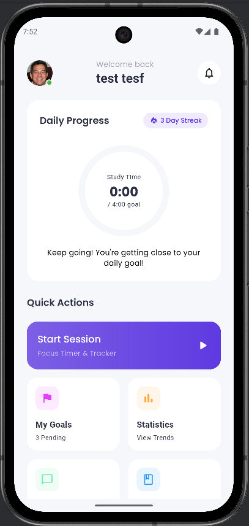
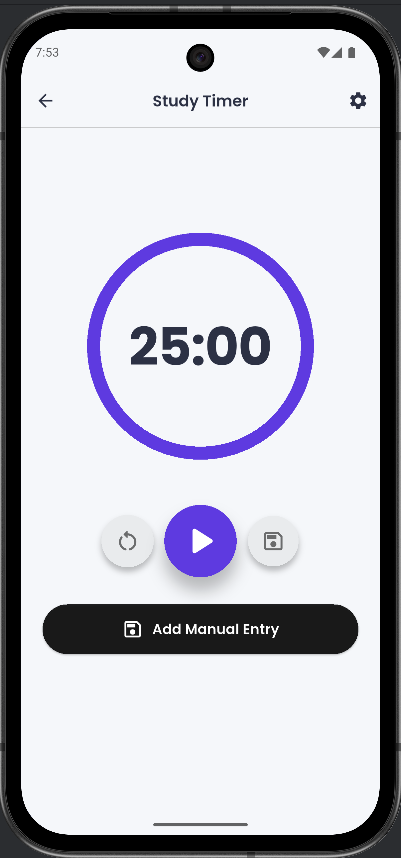
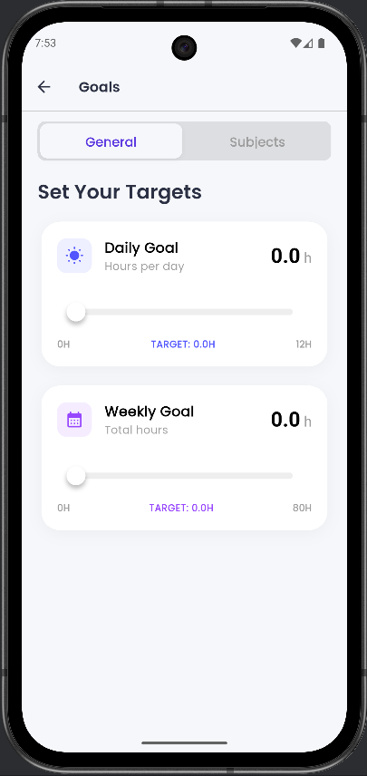
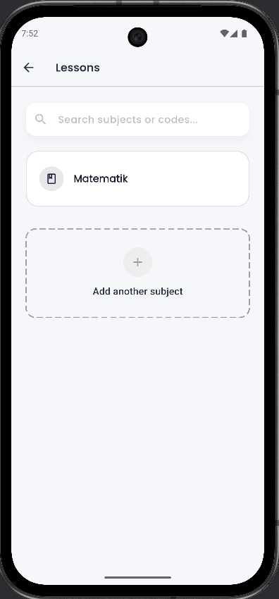
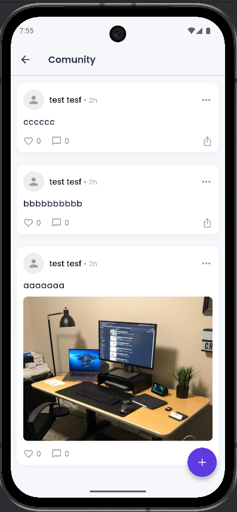
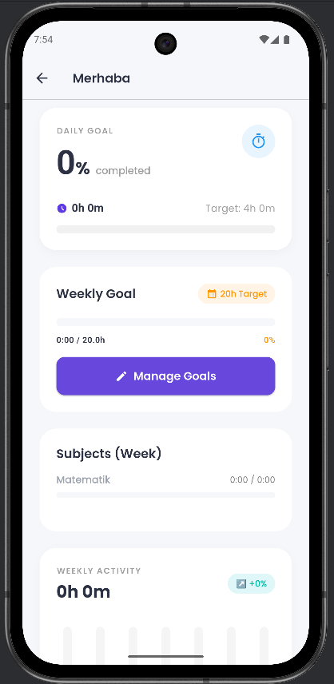
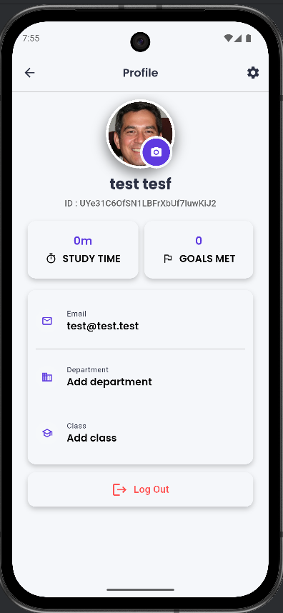
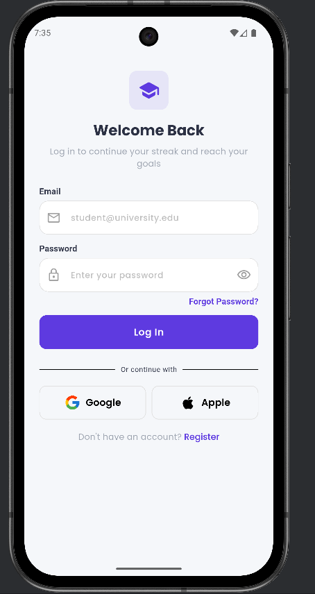
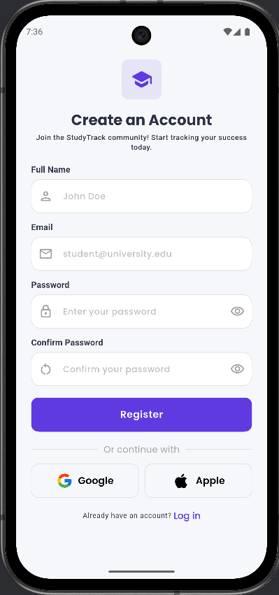

# StudyTrack

StudyTrack, ders bazlı çalışma oturumlarını planlamanı, takip etmeni ve analiz etmeni sağlayan bir Flutter uygulamasıdır. Konular, hedefler, istatistikler ve basit bir topluluk akışı içerir. Durum yönetimi için GetX, kimlik doğrulama ve veri saklama için Firebase kullanır.

## Özellikler
- Ders yönetimi ve hızlı oturum kaydı
- İlerleme göstergeli Pomodoro tarzı zamanlayıcı
- Ders bazlı ve genel günlük/haftalık hedefler
- Haftalık aktivite görselleştirmesiyle istatistikler
- İsteğe bağlı görsel yüklemeli topluluk gönderileri
- Temel kullanıcı bilgileriyle profil ekranı

## Ekran Görüntüleri

### Ana Ekran


### Zamanlayıcı


### Hedefler


### Dersler


### Topluluk


### İstatistikler


### Profil


### Kimlik Doğrulama



## Teknoloji Yığını
- Flutter, Dart
- Firebase (Auth, Firestore, Storage)
- GetX
- UI kütüphaneleri: percent_indicator, dotted_border, icons_plus, google_fonts

## Başlarken
- Flutter SDK kurulu olduğundan ve bir cihaz/emülatör hazır olduğundan emin olun.
- Firebase’i yapılandırın (Google Services JSON/Plist dosyaları `android/` ve `ios/` içinde bulunmalıdır).

### Çalıştırma
```bash
flutter pub get
flutter run
```

## Proje Yapısı
- `lib/views/` ekranlar ve bileşenler
- `lib/controllers/` GetX controller’ları
- `lib/services/` servis katmanı (Firestore, Storage)
- `lib/models/` veri modelleri
- `lib/theme/` tema ve stiller
- `images/` README’de kullanılan ekran görüntüleri
